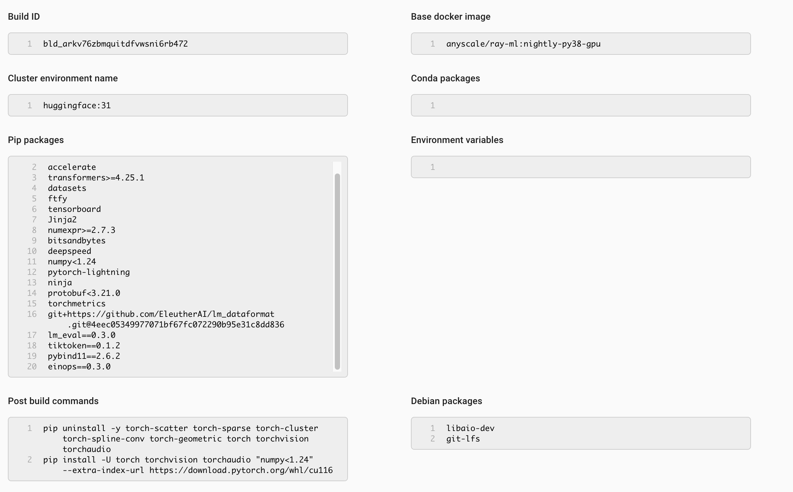

# RWKV on Ray Train

RWKV-v4neo on Ray Train. Only the `RWKV-v4neo/train.py` script has been modified to work on Ray. As we are working on proper pytorch-lightning integration in Ray, some workarounds had to be used.

Cluster environment:

Cluster config:
At least 2 g5.4xlarge or bigger.

Original readme in `ORIGINAL_README.md`.

## Instructions

First, run `prepare.sh`, which will mount NVMe drives on GPU nodes, download the pretrainted RWKV-4-Pile-1B5 model and then download a subset of the Pile dataset (1/16) and tokenize it.

Afterwards, run `train.sh`.